# Well-known-BGP-communities-with-Virtual-WAN
## Overview

Well-known BGP communities are predefined values with universally recognized semantics across BGP-speaking routers. They allow you to influence routing behavior without intricate per-neighbor policy.

In this lab, we'll focus on three well-known communities. A subset of these is particularly useful when customers have multiple branch sites over SD-WAN/VPN and need to limit the number of routes advertised from Azure towards ExpressRoute, which enforces a cap of 1,000 routes. Applying the appropriate communities can help keep advertisements under that threshold while preserving intended reachability and policy.

> **Note (Azure Virtual WAN):** If you're using Azure Virtual WAN, you can also leverage route maps to control and limit which routes are advertised from Azure to ExpressRoute, providing an additional, fine-grained mechanism to stay within the 1,000-prefix limit while maintaining your desired routing policy.

> **Note (Beyond vWAN):** While the examples here center on Virtual WAN, you can achieve similar outcomes when using well-known communities in a Hub-and-Spoke architecture with Azure Route Server (ARS).

### Well-Known BGP Communities

| Community | Description |
|-----------|-------------|
| NO_ADVERTISE | Prevents the route from being advertised to any BGP peers (iBGP or eBGP). |
| LOCAL_AS | Prevents the route from being advertised outside the local autonomous system. |
| NO_EXPORT | Prevents the route from being advertised to external BGP peers (eBGP). |

## Key Takeaways

- Understand how these communities will impact Route propagation your environment.

## Setup Instructions

Download and run the script [community.sh](community.sh) to set up the following base design. We will deploy a cisco 8Kv for this lab.

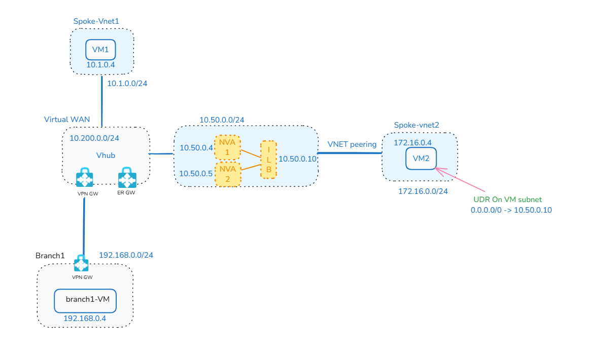

Once the deployment completes follow the below instructions to setup BGP endpoints between the Cisco NVA and Vhub.

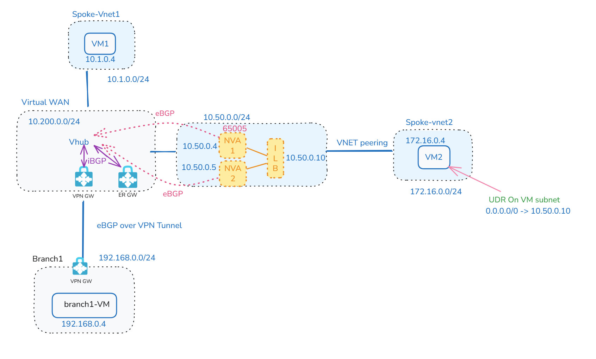

Due to asymmetric routing introduced by BGP ECMP paths, stateful NVAs can drop return traffic and break sessions. To address this, this lab uses the Next Hop IP configuration in Azure Virtual WAN to force symmetric forwarding (via an internal load balancer), ensuring consistent state tracking and stable inspection through the NVA path.

### Find the Vhub router's IPs:

```bash
az network vhub show --name $vhubName --resource-group $resourceGroup --query "virtualRouterIps" --output table
```

### Login to NVA1

```bash
NVA1ID=$(az vm show --name NVA1 --resource-group $resourceGroup --query "id" --output tsv)

az network bastion ssh --name NVAbastionHost --resource-group $resourceGroup --target-resource-id $NVA1ID --auth-type password --username azureuser
```

### Configure Cisco Appliance

Copy paste following on Cisco (both NVA1 and NVA2):

```cisco
# Next-Hop IP Config
conf t
route-map RM permit 10 
 set ip next-hop 10.50.0.10
!
 end
!
# Config on the cisco appliance(both NVA1 and NVA2)
conf t
router bgp 65005 
# Vhub virtual router IP1
neighbor 10.200.0.69 remote-as 65515 
# Vhub virtual router IP1
neighbor 10.200.0.69 ebgp-multihop 255 
# Vhub virtual router IP2
neighbor 10.200.0.70 remote-as 65515
# Vhub virtual router IP2
neighbor 10.200.0.70 ebgp-multihop 255 
!
address-family ipv4
network 172.16.0.0 mask 255.255.255.0
# Vhub virtual router IP1
neighbor 10.200.0.69 activate
neighbor 10.200.0.69 route-map RM out
# Vhub virtual router IP2
neighbor 10.200.0.70 activate 
neighbor 10.200.0.70 route-map RM out
!
end
!
conf t
# add static route to Vhub prefix,Spoke2-VNET and LBprobe IP that point to the default gateway of the Cisco8Kv subnet 
ip route 172.16.0.0 255.255.255.0 10.50.0.1
ip route 10.200.0.0 255.255.255.0 10.50.0.1
ip route 168.63.129.16 255.255.255.255 10.50.0.1
!
end
!
wr mem
!
```

### Login to NVA2

```bash
NVA2ID=$(az vm show --name NVA2 --resource-group $resourceGroup --query "id" --output tsv)

az network bastion ssh --name NVAbastionHost --resource-group $resourceGroup --target-resource-id $NVA2ID --auth-type password --username azureuser
```

Copy paste the above Cisco commands on NVA2.

### Verify BGP Configuration

After the configuration ensure that BGP is up and running. You can verify using Cisco and Azure.

**Cisco:**

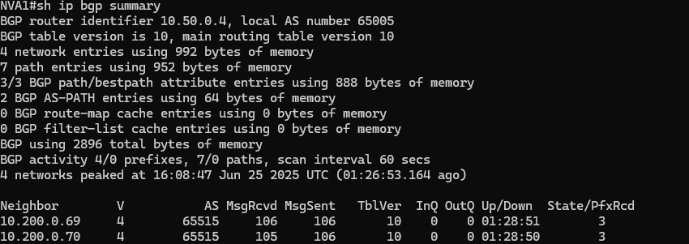
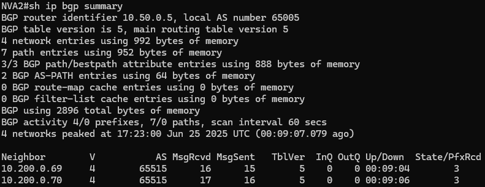

**Azure:**

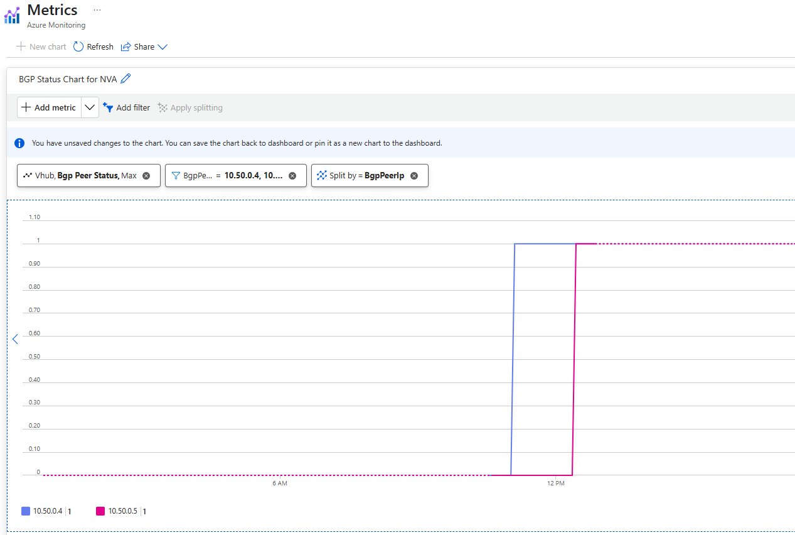


## Routing Observations

Let's take a look at the effective routes for VM2 on Spoke-VNET2. VM2 see the next hop as the NVA ILB

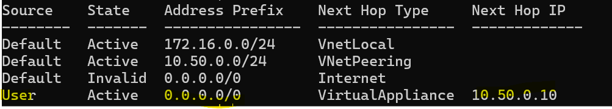

**VPNGW learned Route:** (Spoke-VNET2 prefix 172.16.0.0/24)

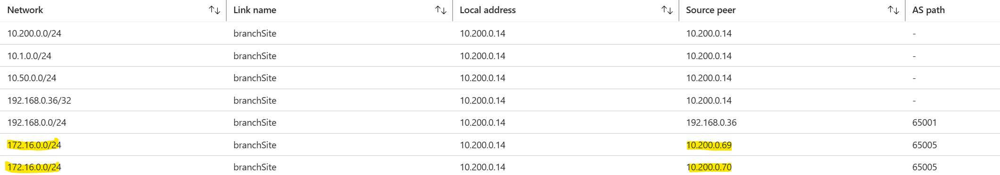

**VPNGW Advertised Route:**(Spoke-VNET2 prefix 172.16.0.0/24 advertised to branch)

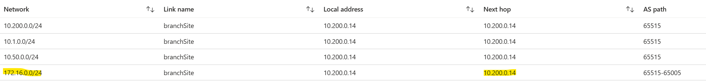

**VM1:**

VM1 routes traffic to 172.16.0.0/24 via Vhub virtual router. Next hop is the routing service IP

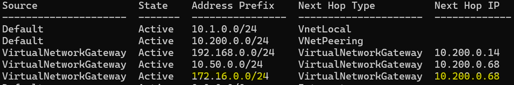

**Vhub:**

The Virtual Hub forwards traffic destined for 172.16.0.0/24 through ILB.

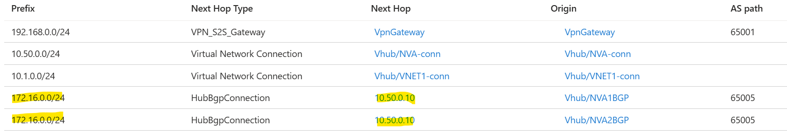

<span style="color: orange;"> VM2 uses the ILB IP as its next hop to reach spoke‑vnet1 due to the default route on the UDR, and VM1 after routing traffic through the Virtual Hub router, will likewise identify the ILB IP as the next hop to reach spoke‑vnet2 (172.16.0.0/24). This alignment in next‑hop selection ensures that both forward and return paths follow the same route, maintaining traffic symmetry.</span>

Now let's ensure Connectivity:

**Branch to VM2:**

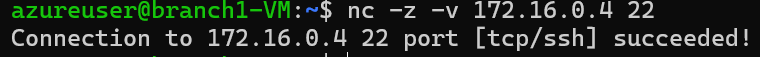

**VM1 to VM2:**

```bash
nc -z -v 10.1.0.4 22
```
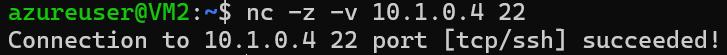

## Testing Well-Known Communities

> **Note:** Please keep in mind that the current test is being done with NVA in the Spoke and BGP peered to Vhub router. But the similar behavior will be observed even if the NVAs were inside the Vhub.

### NO_ADVERTISE Community

Let's add NO_ADVERTISE community to the Cisco NVAs towards the Virtual Router IPs.

**NO_ADVERTISE:** Prevents the route from being advertised to any BGP peers (iBGP or eBGP).

Login to each NVA using the bastion commands shared earlier and copy paste the following commands:

```cisco
# No-Advertise:
conf t
route-map RM permit 10 
 set community no-advertise
 end
!
conf t
router bgp 65005
address-family ipv4
neighbor 10.200.0.69 send-community
neighbor 10.200.0.70 send-community
end
!
wr mem
!
```

**Learned routes on VPN GW:** <span style="color: green;">Spoke-vnet2 prefix (172.16.0.0/24)is no more learned by the VPN GW</span>

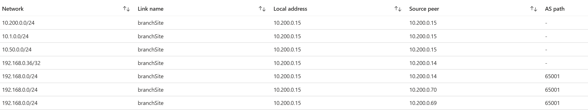

**Routes on VM1:** <span style="color: green;">VM1 still learns Spoke-Vnet2(172.16.0.0/24) routes</span>

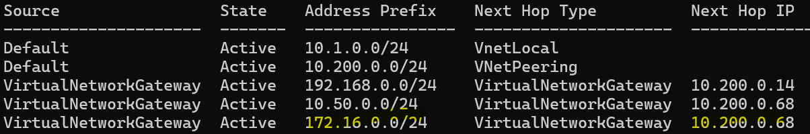

**Connectivity from VM2 to VM1:** Works!

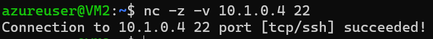

**Connectivity from VM2 to Branch:** <span style="color: green;"> Does not work </span>

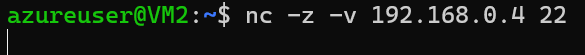

#### Conclusion

<span style="color: green;">**Vhub Router/Routing service honors No-advertise community.**</span> This helps constrain the routes advertised from Azure over SD‑WAN/VPN to ExpressRoute, and can keep them below the ~1,000‑prefix limit.

### LOCAL_AS Community

Let's add LOCAL_AS community to the Cisco NVAs towards the Virtual Router IPs.

**LOCAL_AS:** Prevents the route from being advertised outside the local autonomous system.

Login to each NVA using the bastion commands shared earlier and copy paste the following commands.This will modify the existing configuration from NO-ADVERTISE to LOCAL_AS

```cisco
# LOCAL_AS:
conf t
route-map RM permit 10 
 no set community 
 set community local-AS
 end
!
wr mem
!
```

If you are only testing for LOCAL_AS and do not have the previous configuration we did from NO-ADVERTISE community use the following(Optional):

```
#LOCAL_AS:(OPTIONAL)
conf t
route-map RM permit 10 
 set community local-AS
 end
!
conf t
router bgp 65005
address-family ipv4
neighbor 10.200.0.69 send-community
neighbor 10.200.0.70 send-community
end
!
wr mem
!
```

**VPN GW Learned routes:** <span style="color: green;">Spoke-Vnet2(172.16.0.0/24) routes are learned as they are in the same AS</span>

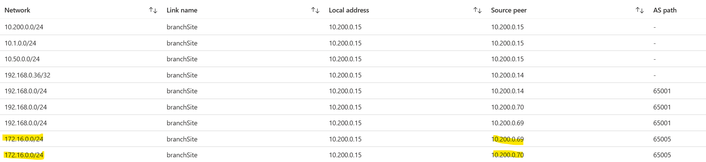

**VPN GW Advertised Routes:** <span style="color: green;">Routes(172.16.0.0/24) are not advertised to branch by VPN GW as they are in a different AS</span>

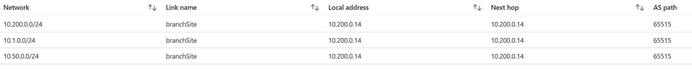

**VM1:** <span style="color: green;">Still learns the route</span>

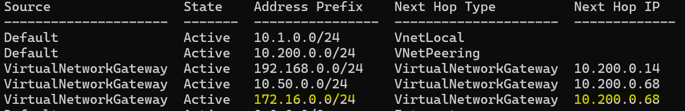

#### Conclusion

<span style="color: green;">**Vhub Router/Routing service and VPN GW honors LOCAL_AS community.**</span>. While Local AS is less commonly used this will also help constrain the routes advertised from Azure over SD‑WAN/VPN to ExpressRoute, and can keep them below the ~1,000‑prefix limit.

### NO_EXPORT Community

**NO_EXPORT:** Prevents the route from being advertised to external BGP peers (eBGP).

Login to each NVA using the bastion commands shared earlier and copy paste the following commands.This will modify the existing configuration from LOCAL_AS to NO_EXPORT.

```cisco
# No-Export:
conf t
route-map RM permit 10 
 no set community 
 set community no-export
 end
!
wr mem
!
```

If you are only testing for NO-EXPORT and do not have the previous configuration we did from NO-ADVERTISE community use the following(Optional):

```cisco
#No-Export:(OPTIONAL)
conf t
route-map RM permit 10 
 set community no-export
 end
!
conf t
router bgp 65005
address-family ipv4
neighbor 10.200.0.69 send-community
neighbor 10.200.0.70 send-community
end
!
wr mem
!
```

**VPN Learned Routes:** <span style="color: green;">VPN learns Spoke2-VNET routes as it is an iBGP peer</span>

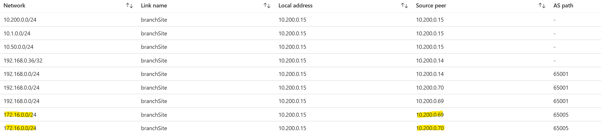

**VPN Advertised routes:** <span style="color: red;">VPN should have not advertised to branch as it is an eBGP peer. But it advertises the routes.</span>

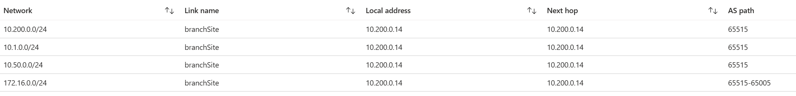

**Branch VM effective Route:**


**Testing Connectivity from VM2 to Branch:** Still works!

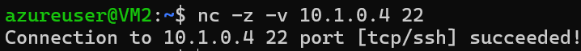

#### Conclusion

<span style="color: red;">**Vhub Router/Routing service and VPN GW do not honor No-Export Community.**</span>

> **Note:** This behavior will likely change in future.

## Behavior with ExpressRoute

Let's discuss the change in behavior with NO_EXPORT community if you had an ExpressRoute circuit connected to the Vhub.

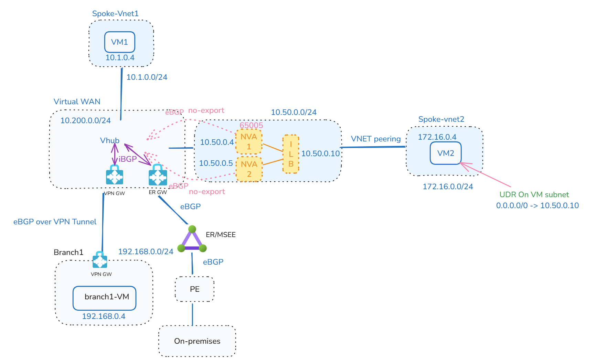

**MSEE/Azure Edge Router:** MSEE learns Spoke-vnet2 prefixes(172.16.0.0/24) as ERGW and Vhub router/routing service do not honor No-Export

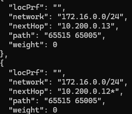

**Branch:** But Branch never learns the Spoke-VNET2 prefix/172.16.0.0/24

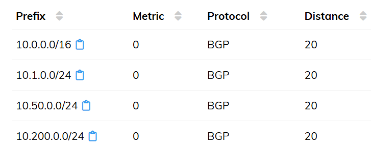

### Conclusion

This is because even though GWs and Vhub router do not honor no-export, <span style="color: green;">**MSEE honors no-export**</span> and hence the routes are not advertised by MSEE back to the branch.However, this does not constrain the routes from Azure to ExpressRoute (MSEE), so you can still hit the ~1,000‑prefix limit.

## Summary

This lab provided an in‑depth look at how Azure Virtual WAN interprets and supports different well‑known BGP communities. The summary below captures the key results.

| BGP Community | vHub Honors It? | VPN Gateway Honors It? | MSEE Honors It? | Will Help Limit to ~1K? |
|---------------|-----------------|------------------------|-----------------|-------------------------|
| NO_ADVERTISE | Yes | Yes | Yes | Yes |
| LOCAL_AS | Yes | Yes | Yes | Yes |
| NO_EXPORT | No | No | Yes | No |
