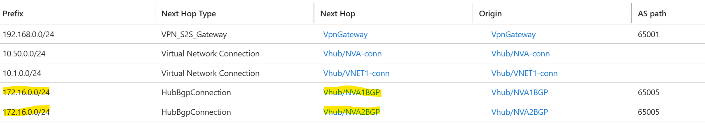

# Well-known-BGP-communities-with-Virtual-WAN

Well-known BGP communities with Virtual WAN

This lab demonstrates how different well-known communities work with Azure Virtual WAN. It covers the deployment of a Virtual WAN, Virtual Hub, and the necessary configurations to enable Next Hop IP and Well-known BGP communities. 

## What are Well-known BGP communities?

Well-known BGP communities are predefined community values that carry specific, universally recognized meanings across BGP-speaking routers. These communities are used to influence routing behavior without requiring complex configuration. In this lab we will focus on the three communities listed below.

### Well-Known BGP Communities

| Community | Description |
|-----------|-------------|
| NO_ADVERTISE | Prevents the route from being advertised to any BGP peers (iBGP or eBGP). |
| LOCAL_AS | Prevents the route from being advertised outside the local autonomous system. |
| NO_EXPORT | Prevents the route from being advertised to external BGP peers (eBGP). |

The primary goal of this lab is to illustrate the behavior before and after enabling Next Hop IP in Azure Virtual WAN. It focuses on the impact this configuration has on stateful inspection in Network Virtual Appliances (NVAs), especially when BGP is used for routing.

## Key Takeaways

- Understand how these communities will impact Route propagation your environment.

## Setup Instructions

Download and run the script [community.sh](community.sh) to set up the following base design. We will deploy a cisco 8Kv for this lab.


Once the deployment completes follow the below instructions to setup BGP endpoints between the Cisco NVA and Vhub.


Login to NVA1 and NVA2 and run the following commands on both.

```bash
resourceGroup="CommunityRG"
location="eastus2"
vwanName="Vwan"
vhubName="Vhub"
vhubAddressPrefix="10.200.0.0/24"
vpnGatewayName="VpnGateway"
erGatewayName="ErGateway"
NVAvnetName="NVA-VNET"
branchvnet="branch1-Vnet"
vnet1="Spoke-VNET1"
vnet2="Spoke-VNET2"
```

### Find the Vhub router's IPs:

```bash
az network vhub show --name $vhubName --resource-group $resourceGroup --query "virtualRouterIps" --output table
```

### Login to NVA1

```bash
NVA1ID=$(az vm show --name NVA1 --resource-group $resourceGroup --query "id" --output tsv)

az network bastion ssh --name NVAbastionHost --resource-group $resourceGroup --target-resource-id $NVA1ID --auth-type password --username azureuser
```

### Configure Cisco Appliance

Copy paste following on Cisco (both NVA1 and NVA2):

```cisco
# Config on the cisco appliance(both NVA1 and NVA2)
conf t
router bgp 65005 
# Vhub virtual router IP1
neighbor 10.200.0.69 remote-as 65515 
# Vhub virtual router IP1
neighbor 10.200.0.69 ebgp-multihop 255 
# Vhub virtual router IP2
neighbor 10.200.0.70 remote-as 65515
# Vhub virtual router IP2
neighbor 10.200.0.70 ebgp-multihop 255 
!
address-family ipv4
network 172.16.0.0 mask 255.255.255.0
# Vhub virtual router IP1
neighbor 10.200.0.69 activate
# Vhub virtual router IP2
neighbor 10.200.0.70 activate 
!
end
!
conf t
# add static route to Vhub prefix,Spoke2-VNET and LBprobe IP that point to the default gateway of the Cisco8Kv subnet 
ip route 172.16.0.0 255.255.255.0 10.50.0.1
ip route 10.200.0.0 255.255.255.0 10.50.0.1
ip route 168.63.129.16 255.255.255.255 10.50.0.1
!
end
!
wr mem
!
```

### Login to NVA2

```bash
NVA2ID=$(az vm show --name NVA2 --resource-group $resourceGroup --query "id" --output tsv)

az network bastion ssh --name NVAbastionHost --resource-group $resourceGroup --target-resource-id $NVA2ID --auth-type password --username azureuser
```

Copy paste the above Cisco commands on NVA2.

### Verify BGP Configuration

After the configuration ensure that BGP is up and running. You can verify using Cisco and Azure.

**Cisco:**


**Azure:**


## Routing Observations

Let's take a look at the effective routes for VM2 on Spoke-VNET2. VM2 see the next hop as the NVA ILB


**VPNGW learned Route:**


**VPNGW Advertised Route:**


**VM1:**

VM1 routes traffic via Vhub virtual router. Next hop is the routing service IP


**Vhub:**

Vhub has two next hop NVA1 and NVA2



### Asymmetric Routing Issue

VM2 identifies the next hop for spoke‑vnet1 (10.1.0.0/24) as the NVA internal load balancer (ILB) because of the static route defined in the UDR. Meanwhile, VM1 forwards traffic to spoke‑vnet2 (172.16.0.0/24) through the Virtual Hub router, which can select either NVA1 or NVA2 as the next hop for that prefix.
This difference in forwarding paths can result in asymmetric routing, for example, traffic from VM1 to VM2 may go out through NVA1 but return through NVA2. While routers can typically handle asymmetric flows without issue, this behavior becomes problematic when traffic passes through stateful devices, which require symmetric paths to maintain session state.

## Configuring Next-Hop IPs

### Login via Bastion on NVA1:

```bash
NVA1ID=$(az vm show --name NVA1 --resource-group $resourceGroup --query "id" --output tsv)

az network bastion ssh --name NVAbastionHost --resource-group $resourceGroup --target-resource-id $NVA1ID --auth-type password --username azureuser
```

Copy and Paste the following commands on both NVA1 and NVA2 after logging in:

```cisco
# Next-Hop IPs
conf t
route-map RM permit 10 
 set ip next-hop 10.50.0.10
 end
!
conf t
router bgp 65005
address-family ipv4
neighbor 10.200.0.69 route-map RM out
neighbor 10.200.0.70 route-map RM out
end
!
wr mem
!
```

### Login via Bastion on NVA2

```bash
NVA2ID=$(az vm show --name NVA2 --resource-group $resourceGroup --query "id" --output tsv)

az network bastion ssh --name NVAbastionHost --resource-group $resourceGroup --target-resource-id $NVA2ID --auth-type password --username azureuser
```

Copy paste the above cisco commands.

### Verify Next-Hop Configuration

Let's look at the Next-hop on the Vhub now:


<span style="color: orange;">It's ILB IP. VM2 uses the ILB IP as its next hop to reach spoke‑vnet1 (10.1.0.0/24), and VM1 after routing traffic through the Virtual Hub router, will likewise identify the ILB IP as the next hop to reach spoke‑vnet2 (172.16.0.0/24). This alignment in next‑hop selection ensures that both forward and return paths follow the same route, maintaining traffic symmetry.</span>

Now let's ensure Connectivity:

**Branch to VM2:**


**VM1 to VM2:**

```bash
nc -z -v 10.1.0.4 22
```


## Testing Well-Known Communities

> **Note:** Please keep in mind that the current test is being done with NVA in the Spoke and BGP peered to Vhub router. But the similar behavior will be observed even if the NVAs were inside the Vhub.

### NO_ADVERTISE Community

Let's add NO_ADVERTISE community to the Cisco NVAs towards the Virtual Router IPs.

**NO_ADVERTISE:** Prevents the route from being advertised to any BGP peers (iBGP or eBGP).

Login to each NVA using the bastion commands shared earlier and copy paste the following commands:

```cisco
# No-Advertise:
conf t
route-map RM permit 10 
 set community no-advertise
 end
!
conf t
router bgp 65005
address-family ipv4
neighbor 10.200.0.69 send-community
neighbor 10.200.0.70 send-community
end
!
wr mem
!
```

**Learned routes on VPN GW:** <span style="color: green;">172.16.0.0/24 is no more learned by the VPN GW</span>


**Routes on VM1:** <span style="color: green;">VM1 still learns Spoke-VNET2(172.16.0.0/24) routes</span>


**Connectivity from VM2 to VM1:**


**Connectivity from VM2 to Branch:** <span style="color: green;">(Does not work)</span>


#### Conclusion

<span style="color: green;">**Vhub Router/Routing service honors No-advertise community.**</span> It is especially useful when customers have multiple branch sites connected via SDWAN/VPN and want to reduce the number of routes advertised down to ExpressRoute which has a limit of 1K routes down.

### LOCAL_AS Community

Let's add LOCAL_AS community to the Cisco NVAs towards the Virtual Router IPs.

**LOCAL_AS:** Prevents the route from being advertised outside the local autonomous system.

Login to each NVA using the bastion commands shared earlier and copy paste the following commands.This will modify the existing configuration from NO-ADVERTISE to LOCAL_AS

```cisco
# LOCAL_AS:
conf t
route-map RM permit 10 
 no set community 
 set community local-AS
 end
!
wr mem
!
```

If you are only testing for LOCAL_AS and do not have the previous configuration we did from NO-ADVERTISE community use the following(Optional):

```
#LOCAL_AS:(OPTIONAL)
conf t
route-map RM permit 10 
 set community local-AS
 end
!
conf t
router bgp 65005
address-family ipv4
neighbor 10.200.0.69 send-community
neighbor 10.200.0.70 send-community
end
!
wr mem
!
```

**VPN GW Learned routes:** <span style="color: green;">Spoke-VNET2 routes are learned as they are in the same AS</span>


**VPN GW Advertised Routes:** <span style="color: green;">Routes are not advertised to branch by VPN GW as they are in a different AS</span>


**VM1:** <span style="color: green;">Still learns the route</span>


#### Conclusion

<span style="color: green;">**Vhub Router/Routing service and VPN GW honors LOCAL_AS community.**</span>

### NO_EXPORT Community

**NO_EXPORT:** Prevents the route from being advertised to external BGP peers (eBGP).

Login to each NVA using the bastion commands shared earlier and copy paste the following commands.This will modify the existing configuration from LOCAL_AS to NO_EXPORT.

```cisco
# No-Export:
conf t
route-map RM permit 10 
 no set community 
 set community no-export
 end
!
wr mem
!
```

If you are only testing for NO-EXPORT and do not have the previous configuration we did from NO-ADVERTISE community use the following(Optional):

```cisco
#No-Export:(OPTIONAL)
conf t
route-map RM permit 10 
 set community no-export
 end
!
conf t
router bgp 65005
address-family ipv4
neighbor 10.200.0.69 send-community
neighbor 10.200.0.70 send-community
end
!
wr mem
!
```

**VPN Learned Routes:** <span style="color: green;">VPN learns Spoke2-VNET routes as it is an iBGP peer</span>


**VPN Advertised routes:** <span style="color: red;">VPN should have not advertised to branch as it is an eBGP peer. But it advertises the routes.</span>


**Branch VM effective Route:**


**Testing Connectivity from VM2 to Branch:**


#### Conclusion

<span style="color: red;">**Vhub Router/Routing service and VPN GW do not honor No-Export Community.**</span>

> **Note:** This behavior will likely change in future.

## Behavior with ExpressRoute

Let's discuss the change in behavior with NO_EXPORT community if you had an ExpressRoute circuit connected to the Vhub.


**MSEE/Azure Edge Router:** MSEE learns the routes as ERGW and Vhub router/routing service do not honor No-Export


**Branch:** But Branch never learns the Spoke-VNET2 prefix/172.16.0.0/24


### Conclusion

This is because even though GWs and Vhub router do not honor no-export, <span style="color: green;">**MSEE honors no-export**</span> and hence the routes are not advertised by MSEE back to the branch.
